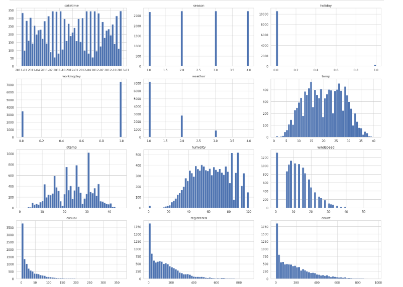
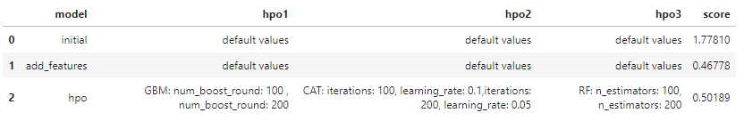
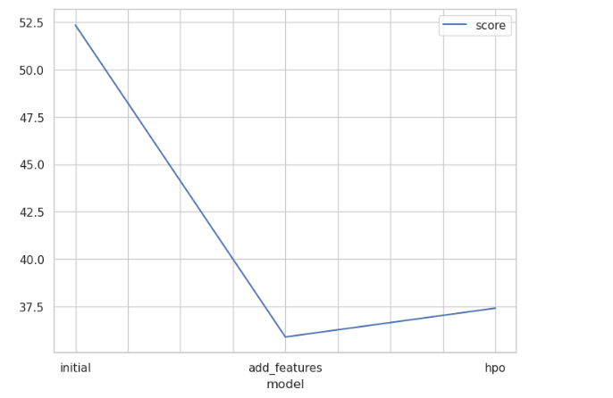
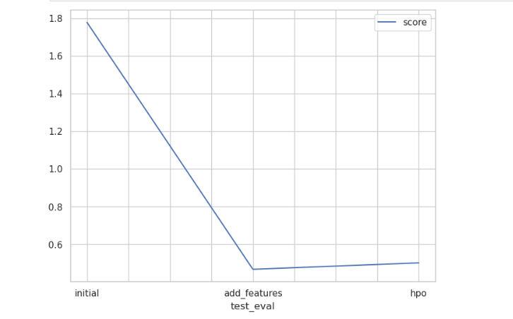

# Report: Predict Bike Sharing Demand with AutoGluon Solution
Ramkumar M 
Date - 15-March-2024

## Initial Training
### What did you realize when you tried to submit your predictions? What changes were needed to the output of the predictor to submit your results?

Model performance is low, as I have not performed any feature engineering. This can be due to datetime feature which is not split into month, day, year etc. 

Also while submitting it is important to remove negative values in predictions that it will be accepted in kaggle submission

### What was the top ranked model that performed?

From all the experiments that I have performed it appears that WeightedEnsemble type models are performing well compared to other model. This is an ensemble type of model -  WeightedEnsemble refers to a method for combining predictions from multiple models. 

**Experiment 1 - Base experiment**

- WeightedEnsemble_L3  - RMSE 1.77810

**Experiment 2 - Feature Engineering**

- WeightedEnsemble_L3   - RMSE 0.46778

**Experiment 3 - HPO**

- WeightedEnsemble_L2  - RMSE 0.50189

  From the above values we can see that WeightedEnsemble_L3 model from experiment 2 has performed well.

  ---
  

## Exploratory data analysis and Feature creation

### What did the exploratory analysis find and how did you add additional features?

Key Finding 
- There are no missing values in the data
- **Datetime**: It seems to have a uniform distribution except for some gaps, which might represent missing data or no bike rentals during specific periods (likely night hours). Additional features like hour, day, month, and year could be extracted to capture the cyclical nature of time, which can affect bike rental frequency.
- **Season**: This categorical feature has four distinct values likely representing the four seasons. Since it is categorical, no further feature engineering is necessary besides possibly ensuring it's treated as a categorical variable during modeling.
- **Workingday**: There's a noticeable balance between working days and non-working days, which may significantly influence rental patterns.
- **Temp and Atemp**: These two features show a somewhat bell-shaped distribution, indicating that there are common average temperatures where bike rentals occur.

### How much better did your model preform after adding additional features and why do you think that is?

The improvement in RMSE from 1.77810 to 0.46778 is substantial, indicating a significant enhancement in model performance after adding additional features. Here's why I think these particular features likely had a positive impact:

**Time-based Features (hour, day, month, year):** Time-based features can capture trends and patterns that are not evident when looking only at the raw datetime. 
- For instance, the hour of the day can capture daily patterns in bike usage (like rush hours), the day of the month might capture paydays or end-of-month effects, the month can reflect seasonal variations, and the year can account for overall trends over time, such as increases or decreases in bike usage.

**Categorical Features (season, weather):** By converting the 'season' and 'weather' variables to categorical types, the model can better utilize the ordinal nature of these variables. 
- This tells the model that these are discrete groups with no inherent numerical order, which can lead to more appropriate splits in decision trees or more accurate coefficients in linear models, among other benefits.

## Hyperparameter tuning
### How much better did your model perform after trying different hyperparameters?

The performance of the model dropped a bit with hyperparameter, Following are the insights,

- This suggests that the hyperparameter tuning did not improve the model's predictive accuracy compared to the feature-engineered model. This could be due to several reasons, including overfitting the training data, not finding the optimal hyperparameters, or the model already performing near its capacity with the given features.

- If the search space for the hyperparameters was not appropriately set or if the tuning was too restricted, the best hyperparameters might not have been explored. This might lead to suboptimal performance compared to a model with well-
chosen hyperparameters.

- The right combination of features, model architecture, and hyperparameters is critical. It's also possible that the model from Experiment 2 was already well-tuned to the feature space, and further hyperparameter adjustments could not extract additional performance gains.

### If you were given more time with this dataset, where do you think you would spend more time?

Following are the areas which I will focus on to get better and more stable performance of the model,

- **Feature Engineering**: Dive deeper into creating more sophisticated features, possibly looking into interactions between features, polynomial features for capturing non-linear relationships, and more granular time-based features like time of day or week.

- **Hyperparameter Tuning**: Further refine the hyperparameter tuning process using more advanced techniques like Bayesian optimization or genetic algorithms, which may lead to better model performance than grid or random search.

- **Data Preprocessing**: Investigate additional preprocessing steps, like normalization or transformation of skewed features, handling of outliers, or more sophisticated imputation methods for missing data.

### Create a table with the models you ran, the hyperparameters modified, and the kaggle score.

### Create a line plot showing the top model score for the three (or more) training runs during the project.

TODO: Replace the image below with your own.

### Create a line plot showing the top kaggle score for the three (or more) prediction submissions during the project.

TODO: Replace the image below with your own.

## Summary
TODO: Add your explanation
